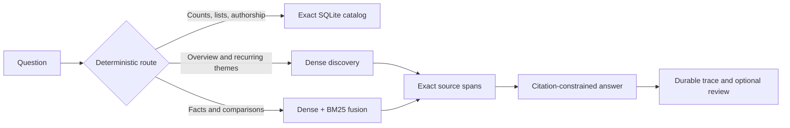

# Author Corpus RAG

Author Corpus RAG is a local-first system for asking grounded questions about
one or more authors' work. It combines exact metadata queries, structure-aware
semantic retrieval, hard author scopes, citation-constrained generation, and
durable evidence traces.

The project started from a simple RAG failure: a vector search was asked how
many articles an author had written and confidently answered from the handful
of passages it retrieved. Exact questions should inspect the complete catalog,
not infer totals from top-k semantic matches. This project makes that boundary
explicit.

## What it does

- Ingests source-agnostic Markdown into normalized logical documents with
  multiple authors and multiple source URIs.
- Answers exhaustive counts, lists, authorship, coauthor, and source-inventory
  questions with an exact SQLite catalog.
- Routes broad exploration to diversity-oriented dense retrieval and focused
  questions to dense/BM25 reciprocal-rank fusion.
- Preserves Markdown structure, exact source character ranges, author
  narration, quotations, and uncertain voice through indexing and retrieval.
- Applies author filters before ranking so a dominant author cannot crowd a
  rare author out of scoped results.
- Requires cited evidence for generated answers and abstains when citation or
  multi-author coverage requirements are not met.
- Persists query traces, timings, failed generation attempts, exact evidence,
  and separate append-only human reviews.
- Offers a local notebook and a Gradio chat, trace-inspection, and review
  interface.

## How questions flow



Exact catalog answers bypass embeddings and generation. Semantic results are
explicitly non-exhaustive. Generated prose is never treated as source truth,
and review decisions are stored separately from model suggestions.

For the complete system, ingestion, conversation, provenance, reasoning, and
persistence diagrams, see [Architecture](docs/architecture.md).

## Current validation snapshot

Last verified on 2026-07-29 with Python 3.14. These are regression and
integration results for the current repository, not claims of production
accuracy.

| Check | Current result | Scope |
| --- | ---: | --- |
| Ruff formatting and lint | Pass | Complete committed Python/notebook tree |
| Strict mypy | Pass across 70 source files | Checked Python interfaces |
| Automated tests | 206 passed in 5.86s | Deterministic pipeline regressions |
| Headless notebook smoke | 15/15 cells in 12.495s | Fresh kernel; model calls and missing-index builds disabled |
| Query-routing baseline | 23/23 routes; 8/8 exact tools | Small committed synthetic set |
| Claim/evidence baseline | 28/29 exact labels | 96.6% accuracy; 82.8% non-abstention coverage |
| Claim false-support check | 1/26, or 3.8% | Known entity-role-reversal failure remains exposed |

An aggregate-only private integration check loaded 78 normalized documents
with 13 credited authors, including three multi-author documents. Structured
chunking produced 645 passages, all with exact versioned source spans. In a
rare-author smoke check, discovery, dense, BM25, and fused retrieval returned
only the scoped author even though that author had one document.

The private check validates ingestion, indexing, provenance, and hard scope
isolation; it does not establish answer quality or generalization. The
claim-classifier miss swaps the subject and object of a sentence, which is why
the lexical heuristic cannot replace semantic evaluation or evidence review.
Timings are a local snapshot and vary by machine. No private names, titles,
questions, passages, or source locations are committed.

Reproduce the public checks:

```bash
uv run ruff format --check .
uv run ruff check .
uv run mypy
uv run pytest -q
uv run python scripts/smoke_notebook.py
```

## Quick start

Install Python 3.14 and
[uv](https://docs.astral.sh/uv/getting-started/installation/), then run:

```bash
uv sync --dev --extra local --extra ui
cp corpus.example.yaml corpus.local.yaml
cp retrieval-eval.example.yaml retrieval-eval.local.yaml

export AUTHOR_CORPUS_CONFIG="$PWD/corpus.local.yaml"
export AUTHOR_CORPUS_RETRIEVAL_EVAL="$PWD/retrieval-eval.local.yaml"

uv run --extra local author-corpus build-index
uv run --extra local --extra ui author-corpus chat --inbrowser
```

The chat binds to `127.0.0.1`, disables analytics and saved UI history, and
does not create a public share link. For Jupyter kernel registration, index
controls, environment options, and the knowledge cache, see
[Getting started](docs/getting-started.md).

## Three query contracts

| Question type | Example | Contract |
| --- | --- | --- |
| Exact metadata | “How many articles has this author written?” | Inspect every matching catalog record; skip retrieval and generation |
| Broad discovery | “What themes recur across these essays?” | Retrieve diverse documents; state that coverage is non-exhaustive |
| Focused evidence | “How does the author explain heat acclimation?” | Fuse dense and lexical evidence; answer only with citations |

Multi-author comparisons require retrieved and cited evidence for every
selected author. A scope/query name conflict, unknown author, ambiguous alias,
missing evidence, or failed citation repair stops rather than silently widening
the search.

## Reliability boundaries

The project deliberately separates artifacts by authority:

1. Normalized source documents and exact metadata are corpus truth.
2. Retrieved passages are inspectable evidence, not conclusions.
3. Generated answers and cached summaries are suggestions.
4. Deterministic and semantic verifiers are evaluated decisions, not proof.
5. Only explicit accept/revise actions create audited review records.

Dense similarity, BM25 relevance, and fused rank values are different score
types, not interchangeable confidence scores. Cached navigation summaries can
help find material but cannot support an answer without validated source spans.
Bounded multi-step reasoning can retrieve and verify twice; it cannot guarantee
that every relevant document was found.

## Documentation

| Guide | Read this for |
| --- | --- |
| [Getting started](docs/getting-started.md) | Installation, private configuration, index building, notebook use, Gradio, and cache behavior |
| [Retrieval and query behavior](docs/retrieval.md) | Routing, exact queries, author scopes, hybrid retrieval, structure, voice, citations, and retrieval evaluation |
| [Evaluation, reasoning, and review](docs/evaluation-and-review.md) | Claim evaluation, semantic verifier experiments, bounded reasoning, evidence ledgers, review, and export |
| [Architecture](docs/architecture.md) | Mermaid diagrams from system context through persistence and component boundaries |
| [Public demo design](docs/public-demo.md) | Public-domain corpus policy, GitHub Actions, Pages limitations, and deployment phases |

## Project status

The core local pipeline is functional: ingestion, exact catalog execution,
dense/BM25 retrieval, author-aware scoping, grounded generation, durable
tracing, bounded reasoning, evaluation, synthesis, and review all have
implemented paths and regression coverage.

The next public milestone is a checksum-pinned, public-domain multi-author
corpus and a static evidence explorer. GitHub Pages can host the catalog,
client-side retrieval, citations, coverage warnings, and precomputed traced
examples. It cannot host the current Python, SQLite, Gradio, or local-model
runtime; arbitrary live generation requires a separate backend.

## Privacy

Committed examples and tests use synthetic authors and documents. Local paths
and corpus metadata live in ignored `*.local.yaml` or `.env` files. Source
documents, generated indexes, traces, reviews, and private exports remain
outside version control, and pre-commit strips notebook output.
