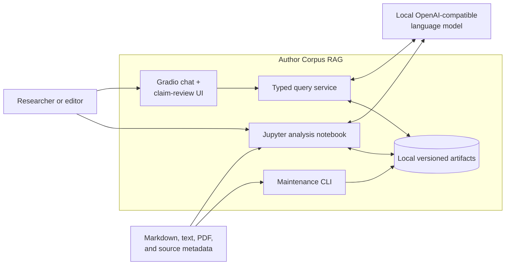
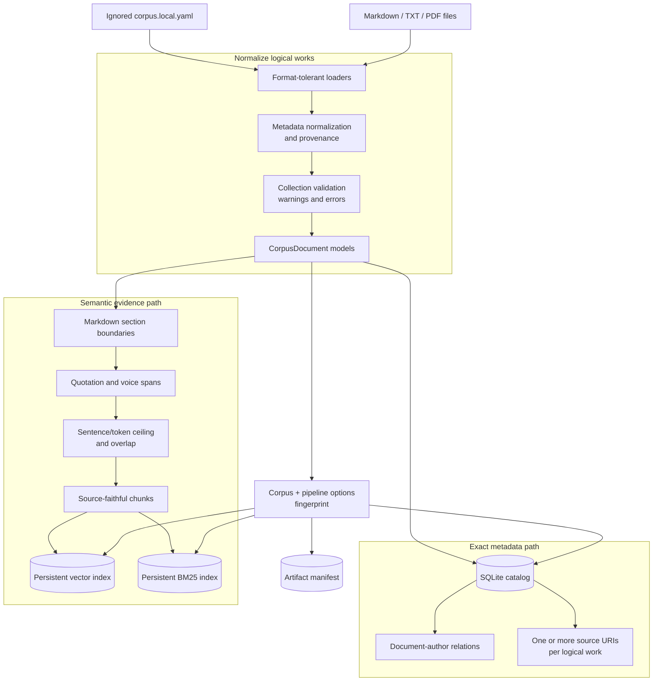
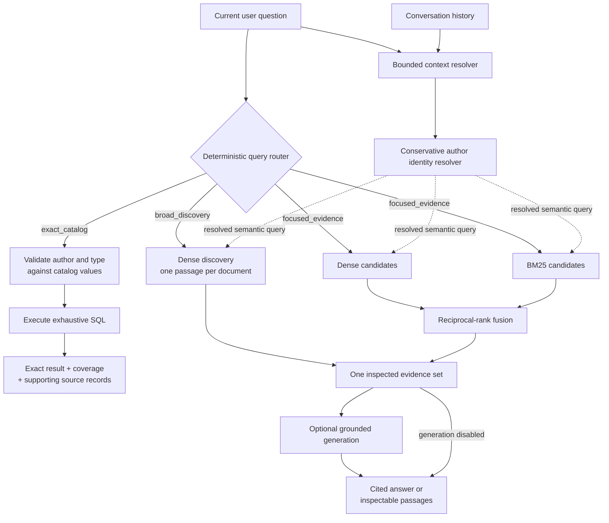
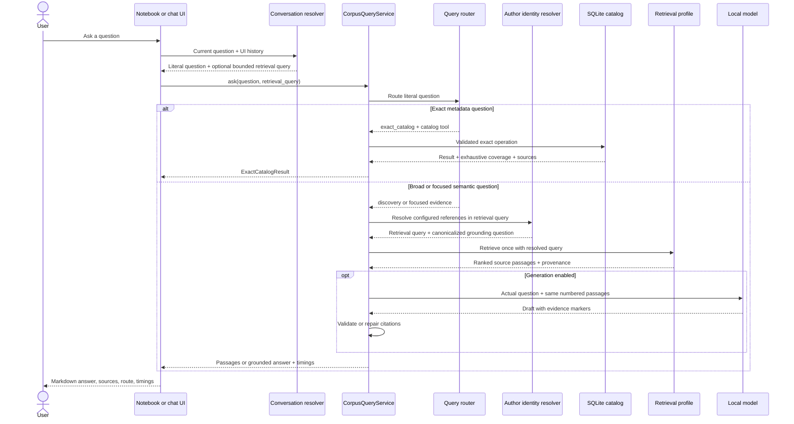
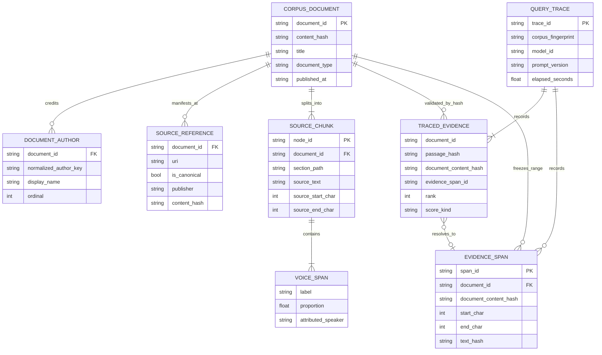
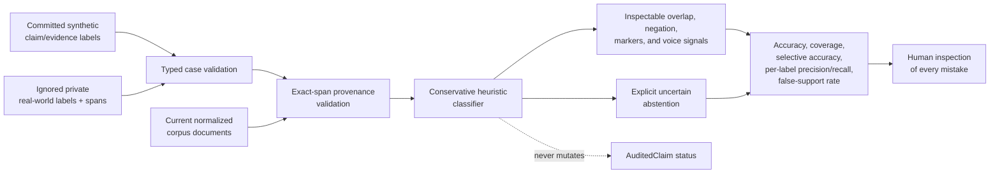
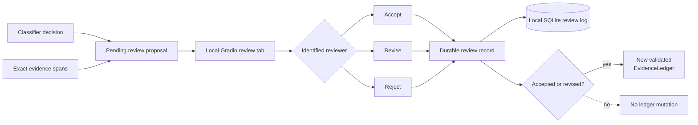

# Author Corpus RAG architecture

This document describes the implemented system boundaries and the invariants
that keep corpus answers auditable. It is source-agnostic: private author names,
publisher details, file paths, and evaluation judgments remain in ignored local
configuration.

The diagrams describe implemented behavior. Future work is called out in prose
rather than silently presented as a current component.

## Level 0: system context

The system is local-first. Corpus inputs, generated indexes, model requests,
and query traces do not need to leave the machine. Gradio is an interface over
the same query service; it is not a second retrieval implementation.

## Level 1: ingestion and artifact pipeline

`CorpusDocument` represents a logical work, not a file or URL. A work can have
multiple publication locations through `source_uris`, and author credits are a
many-to-many relation. The exact catalog therefore counts logical works once
while retaining all credited authors and manifestations.

The semantic index embeds structural context—title, heading path, and section
lead—but returns untouched source passages as evidence. Voice analysis labels
document-author narration, quoted speech, mixed spans, and uncertainty before
retrieval. It does not claim that prose from a coauthored document belongs to
one individual coauthor.

## Level 2: routed question execution

Routing always uses the literal current question. For semantic follow-ups, the
context resolver may append only the immediately preceding user question to the
retrieval query. It never appends generated assistant text, and it never
rewrites an exact catalog question. The identity resolver then replaces only
the configured default-author name, explicitly trusted aliases, and generic
phrases such as “the author” with a corpus-author retrieval role. It does not
guess nickname relationships. The literal or bounded-context question—not the
retrieval keywords—is passed to grounded generation with only explicitly
resolved author references canonicalized.

The three routes have deliberately different coverage contracts:

| Route | Engine | Coverage claim | Typical use |
| --- | --- | --- | --- |
| `exact_catalog` | SQLite | Exhaustive over ingested metadata | Counts, author lists, coauthors, source inventory |
| `broad_discovery` | Dense retrieval with document diversity | Non-exhaustive | Themes, style exploration, representative works |
| `focused_evidence` | Dense + BM25 + reciprocal-rank fusion | Non-exhaustive | Specific claims, explanations, comparisons, passages |

The query service retrieves semantic evidence exactly once. If generation is
enabled, `GroundedAnswerer` receives that already-inspected result; it does not
perform a second retrieval that could change the evidence or double latency.

## Level 3: one conversational turn

Each phase records wall-clock time separately. Dense similarity, BM25 relevance,
and reciprocal-rank-fusion scores retain their score kinds and component ranks;
the system never treats them as a common confidence scale.

## Level 4: provenance and persistence model

Generated answers are evidence views, not durable corpus truth. Query traces
retain the literal user question, contextualized retrieval query, passage
hashes, document hashes, retrieval settings, prompt/model settings, citations,
exact half-open ranges in normalized `CorpusDocument.content`, and elapsed time.
Citation markers resolve through traced evidence to versioned `EvidenceSpan`
records, so validation can detect a missing document, changed document version,
out-of-bounds range, or changed text at that range. These are normalized-corpus
offsets, not byte offsets into original HTML or PDF files. Older trace JSON
remains readable but is marked unversioned when it has no exact span. Both the
notebook and the chat query service persist generated semantic answers through
the same local trace store.

## Level 5: offline claim-classification evaluation

The classifier labels one claim/evidence pair as `supports`, `qualifies`,
`contradicts`, `updates`, `attributed_report`, `insufficient`, or `uncertain`.
It emits deterministic signals and a rationale, not a confidence score. The
benchmark is an offline regression harness: predictions never promote a claim
to audited truth or enter generation automatically. Committed cases are
synthetic; ignored local cases are required before drawing conclusions about a
private corpus. Provenance-bearing cases must still resolve to the same
versioned source text; stale labels stop notebook evaluation instead of silently
testing a different passage. The committed set deliberately retains a known
entity-role reversal miss, making the current false-support failure measurable.

## Level 6: explicit human claim review

A proposal preserves the classifier rationale, exact source spans, and corpus
fingerprint but contains no audited claim. An explicit reviewer action creates a
durable record. Accept preserves the proposal exactly; revise requires a fully
specified `AuditedClaim`; reject records the decision without producing a
claim. Applying an approved record returns a new immutable ledger and refuses
cross-corpus evidence or evidence that was not available in the proposal.
Qualification suggestions require revision because a scope marker alone does
not provide a reviewer-authored qualifier.

## Cache and rebuild boundaries

| Artifact | Persistence | Rebuild trigger | Role |
| --- | --- | --- | --- |
| SQLite catalog | Fingerprinted local cache | Corpus or index options change | Exhaustive metadata facts |
| Vector index | Fingerprinted local cache | Corpus, embedding model, chunking, or pipeline version changes | Dense retrieval |
| BM25 index | Fingerprinted local cache with completion manifest | Vector node set or lexical pipeline changes | Exact-term retrieval arm |
| Document summaries | SQLite cache | Document hash, model, prompt, or summary settings change | Experimental navigation only |
| Query traces | SQLite cache | Append-only per generated answer | Citation-to-span provenance, reproducibility, and staleness checks |
| Claim reviews | SQLite audit log | Append-only per explicit reviewer action | Durable accept, revise, and reject decisions |

Caching improves latency; it does not upgrade generated summaries into source
evidence. Exact queries always read normalized metadata, and grounded answers
always cite retrieved source passages.

## Reliability invariants

1. Exact corpus totals and exhaustive lists come only from SQLite, never top-k
   retrieval or an LLM.
2. Unknown or ambiguous authors and document types stop for clarification; they
   never silently become zero, a default author, or an unfiltered corpus query.
3. A unique first or last name may resolve to one catalog author. A shared alias
   remains ambiguous.
4. Semantic results always report `exhaustive=False`.
5. Generation uses the exact passages already returned for inspection.
6. Factual answer paragraphs require valid numbered evidence markers.
7. Current-index citation markers resolve to exact versioned source ranges;
   historical traces without ranges remain explicitly unversioned.
8. Quoted speech is not attributed to a document author merely because it
   appears in that author's article.
9. Conversation context uses previous user wording only; prior model output is
   never treated as retrieval evidence.
10. Semantic author aliases are explicit private configuration, are checked for
    catalog collisions, and are never inferred with fuzzy matching.
11. Score kinds remain explicit and incomparable across retrieval methods.
12. Heuristic claim classifications never mutate manually audited claim status;
    uncertainty and attributed reports remain distinct from support.
13. Only an explicit identified reviewer can create an applicable review record;
    rejected reviews and cross-corpus proposals cannot update a ledger.
14. Private corpus configuration, evaluation labels, caches, and notebook output
    stay outside version control.

## Component map

| Concern | Primary module |
| --- | --- |
| Input normalization | `src/author_corpus/ingestion.py` |
| Logical document models | `src/author_corpus/models.py` |
| Exact SQLite catalog | `src/author_corpus/catalog.py` |
| Validated exact execution | `src/author_corpus/exact.py` |
| Structure and voice chunking | `src/author_corpus/structure.py`, `voice.py`, `indexing.py` |
| Dense/BM25 profiles and fusion | `src/author_corpus/hybrid.py`, `retrieval.py` |
| Query routing | `src/author_corpus/routing.py` |
| Conservative author identity | `src/author_corpus/identity.py` |
| Single-retrieval orchestration | `src/author_corpus/service.py` |
| Bounded conversation context | `src/author_corpus/conversation.py` |
| Private runtime loading | `src/author_corpus/runtime.py` |
| Local chat and claim-review UI | `src/author_corpus/ui.py` |
| Citation-constrained generation | `src/author_corpus/answering.py` |
| Exact evidence spans and answer audit trail | `src/author_corpus/audit.py`, `tracing.py` |
| Offline claim/evidence classification | `src/author_corpus/claim_classification.py` |
| Explicit human claim review | `src/author_corpus/review.py` |
| Notebook and maintenance entry points | `notebooks/`, `src/author_corpus/cli.py` |
